# Born2beroot-Tutorial 🖥🇪🇸


## Sobre este tutorial

Esta guía esta basada integramente en el trabajo previo realizado por gemartin99. Por ello, si la guía te sirve de ayuda, es de recibo ponerle una estrella a gemartin99 en su github, y de agradecer ponerme otra en mi espacio, por el trabajo de recomponerla.

GitHun de gemartin99 para darle Star => [](https://github.com/gemartin99/Born2beroot-Tutorial)

Asimismo, no te ciñas a solo seguir los pasos de la misma Interioriza y entiende el porque de cada uno de ellos, para adquirir la base pretendida con este proyecto.

# Índice

1. [Descargar imagen de la maquina virtual 💿](#1--descargar-imagen-de-la-maquina-virtual-)
2. [Instalación de la maquina 💻](#2--instalacion-de-la-maquina-)
3. [Instalación Debian 🌀](#3--instalación-debian-)
4. [Configuración de la máquina virtual ⚙️](#4-configuración-de-la-máquina-virtual-%EF%B8%8F)

	4.1 [Instalación de sudo y configuración de usuarios y grupos 👤](#41---instalación-de-sudo-y-configuración-de-usuarios-y-grupos-)
	
	4.2 [Instalación y configuración de SSH 📶](#42---instalación-y-configuración-ssh-)
	
	4.3 [Instalación y configuración de UFW 🔥🧱](#4-3-instalació-y-configuración-de-ufw-)
	
	4.4 [Configurar contraseña fuerte para sudo 🔒](#4-4-configurar-contraseña-fuerte-para-sudo-)
	
	4.5 [Configuración de política de contraseñas fuerte 🔑](#4-5-configuración-de-política-de-contraseñas-fuerte-)
	
	4.6 [Conectarse via SSH 🗣](#4-6-conectarse-via-ssh-)
	
5. [Script 🚨](#5--script-)

	5.1 [Resultado total del script 🆗](#5-13-resultado-total-del-script)
	
6. [Crontab ⏰](#6--crontab-)
7. [Signature.txt 📝](#7--signaturetxt-)
8. [Bonus ⭐](#8--bonus-%EF%B8%8F)

	8.1 [Particionado manual del disco 🛠](#81--particionado-manual-del-disco)
	
	8.2 [Wordpress y configuración de servicios 🌐](#82---wordpress-y-configuración-de-servicios-)
	
	8.3 [Servicio adicional ➕](#83---servicio-adicional-)

9. [Hoja de corrección ✅](#9--hoja-de-corrección-)

	9.1 [Respuestas de la evaluación 💯](#9-1-respuestas-de-la-evaluación-)
	
	9.2 [Comandos de la evaluación ⌨️](#9-2-comandos-de-la-evaluación-%EF%B8%8F)
10. [Tester 🆗](#10--tester-)
	
## 1- _Descargar imagen de la maquina virtual_ 💿

[Click aqui](https://www.debian.org/distrib/index.es.html) para redireccionarte a la URL donde puedes descargar la ISO de manera segura.

## 2- Instalacion de la maquina 🛠

Para realizar la instalación se requiere de un software de virtualización. En este tutorial haremos uso de [VirtualBox](https://www.virtualbox.org/). Si ya tienes VirtualBox instalado y dispones de la ISO Debian ya podemos empezar con el tutorial.

1 ◦ Debemos abrir VirtualBox y pinchar sobre ```Nueva```


2 ◦ Escogemos el nombre de nuestra máquina y la carpeta donde estará ubicada. Importante introducir la maquina dentro de la carpeta sgoinfre ya que si no la ubicamos ahí nos quedaremos sin espacio y fallará la instalación (dependiendo del campus la ruta de sgoinfre puede cambiar). 


3 ◦ Seleccionamos la cantidad de memoria RAM que reservaremos para la máquina. 

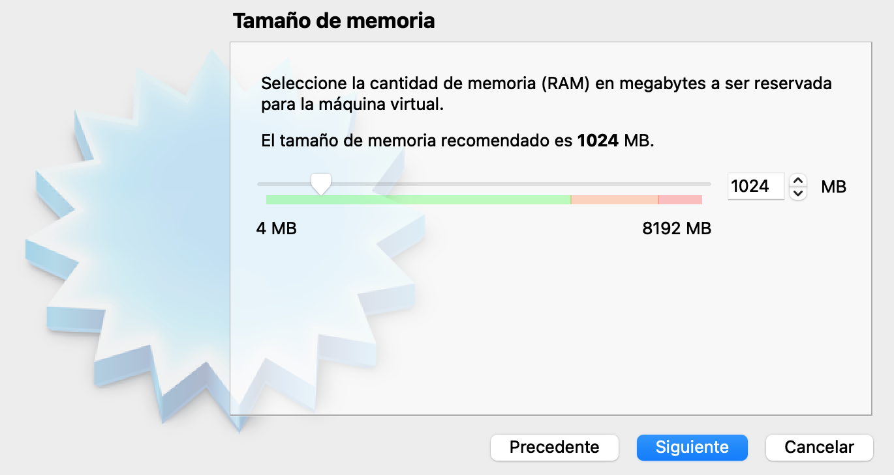

4 ◦ Seleccionamos la segunda opción para asi crear un disco duro virtual ahora.


5 ◦ Escogemos la primera opción ```VDI``` ya que nos hemos descargado una imagen de disco.


6 ◦ Seleccionamos la primera opción ```Reservado dinámicamente``` para que asi se vaya reservando memoria en la máquina real segun vayamos utilizandola en la virtual hasta llegado al límite máximo disponible en la virtual.


7 ◦ Una vez hayamos establecido la cantidad recomendada ```12 GB``` deberemos darle a ```Crear```. Si haremos el bonus seleccionaremos ```30 GB```.


8 ◦ Puede parecer que ya hemos terminado la instalación , pero todavía faltan un par de pasos más. Debemos darle a configuración


9 ◦ Acto seguido pincharemos encima de ```Almacenamiento``` , volveremos a pinchar sobre el emoticono 💿 que se encuentra a la derecha y de nuevo pincharemos sobre ```Seleccionar un archivo de disco```.


10 ◦ Seleccionaremos la ISO que acabamos de descargar y le damos a ```Abrir``` y después le daremos a ```Aceptar```. 


11. ◦ Una vez completados todos los pasos anteriores ya podemos ```Iniciar``` nuestra máquina virtual.


## 3- Instalación Debian 🌀

➤ Espera❗️ Tu vista es muy importante 👀❗️ Para poder hacer la ventana más grande debes hacer lo siguiente: 


Utiliza la tecla ```command``` para que la captura del ratón pase de la maquina real a la virtual y al reves.

### Sigamos con la instalación 🛠

1 ◦ Escogeremos la version sin interfaz gráfica ```Install``` ya que el subject indica que no se utilice ninguna Cada vez que queramos confirmar algo presionaremos ```Enter``` y para movernos por las opciones utilizaremos las flechas.


2 ◦ Escogeremos el idioma que usaremos para la instalación y el predeterminado que se le quedará al sistema ```English```.  


3 ◦ Introducimos nuestro País, territorio o zona. En mi caso pondre ```Other```.


4 ◦ Como he seleccionado other debo indicar mi continente o region. En mi caso pongo ```Europe``` 🇪🇺. 


5 ◦ Seleccionamos el país. En mi caso ```Spain``` 🇪🇸.


6 ◦ Seleccionamos ```United States```.
  


7 ◦ Importante seleccionar ```American English``` como configuración de teclado ya que si no tendremos las teclas mal enlazadas.


8 ◦ En este paso debemos elegir el ```Host Name``` de la máquina, el cual debe ser tu login seguido de 42. 


9 ◦ Este apartado lo dejaremos vacío ya que el subject no mencionada nada de ```Domain name```.


10 ◦ Debemos introducir una contraseña para la cuenta de administración del sistema. Importante apuntarla o hacer una foto ya que le daremos uso. Si quieres ver la contraseña para asegurarte de que la has escrito correctamente debes tabular hasta llegar a la opción ```Show Password in Clear``` debes darle a la barra espaciadora y se mostrara la clave.


11 ◦ Repetimos el proceso de nuevo para comprobar que no la hayamos escrito mal.


12 ◦ Elegimos el nombre de nuestro nuevo usuario. Como indica el subject hay que crear un usuario adicional que no sea el root con nuestro login, por ese motivo llamaré ```gemartin``` a mi nuevo usuario.


Volvemos a poner el nombre de usuario.

<!--

-->


13 ◦ Ahora debemos introducir la contraseña de nuestro nuevo usuario. Como la anterior , repetiremos el proceso para comprobar que no la hayas escrito mal y tambien es importante que la guardes porque le daremos uso más adelante.


14 ◦ Seleccionamos la hora de nuestra ubicación.


15 ◦ Esocgeremos la tercera opción ```Guied - use entire disk and set up encrypted LVM``` ya que el subject nos dice que deben ser particiones cifradas. ⚠️❗️ Si quieres hacer el bonus deberás darle a ```Manual``` y [hacer click aquí](#8--bonus-%EF%B8%8F) ❗️⚠️


16 ◦ Seleccionamos el disco en el que queremos hacer el particionado (Solo debe haber un disco). 


17 ◦ Una vez hayamos escogido el disco deberemos hacer el particionado tal y como nos piden. Para realizarlo adecuadamente debemos seleccionar la segunda opción ```Separate /home partition```.


18 ◦ Esocgemos la opción ```Yes``` para que asi se escriban los cambios en el disco y podamos configurar el gestor de volumenes lógicos (LVM).


19 ◦ Le damos a Cancel ya que el borrado de datos en el disco no es necesario.

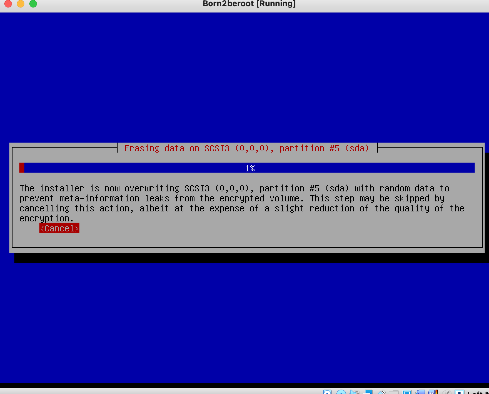

20 ◦ De nuevo deberemos poner una contraseña, esta vez será la frase de encriptación. Como te he comentado previamente deberás repetir el proceso y la debes anotar ya que será importante en un futuro.


21 ◦ En este paso debemos introducir la cantidad de volumen que usaremos para la partición guiada. Debemos introducir ```max``` o el numero de tamaño maximo disponible en mi caso es ```12.4 GB```.


22 ◦ Para finalizar la partición y escribir los cambios en el disco le daremos a la opción ```Finish partitioning and write changes to disk```.


23 ◦ Seleccionamos la opción ```Yes``` para continuar y confirmar que no queremos hacer más cambios en el disco.


24 ◦ Seleccionamos la opción ```No``` ya que no necesitamos paquetes adicionales. 


25 ◦ Escogemos nuestro País.


26 ◦ Escogemos ```deb.debian.org``` ya que es lo que recomienda debian.


27 ◦ Esta opción la dejaremos vacía y le daremos ```Continue```.


28 ◦ Seleccionamos la opcion ```No``` ya que no queremos que los developers vean nuestras estadísticas aunque sean anónimas.


29 ◦ Quitaremos todas las opciones de software (con la barra espaciadora) y le daremos a ```Continue```.


30 ◦ Seleccionaremos ```Yes``` para instalar [GRUB boot](https://es.wikipedia.org/wiki/GNU_GRUB) en el disco duro.


31 ◦ Escogeremos el dispositivo para la instalación del cargador de arranque ```/dev/sda (ata_VBOX_HARDDISK)```.


32 ◦ Le daremos a ```Continue``` para finalizar la instalación. 


## 4 Configuración de la máquina virtual ⚙️

➤ Lo primero que debemos hacer es seleccionar ```Debian GNU/Linux```.

➤ Debemos introducir la contraseña de encriptación que utilizamos previamente. En mi caso es ```Hello42bcn```.


➤ Debemos introducir el usuario y contraseña que hemos creado. En mi caso el usuario es ```gemartin``` y la contraseña ```Hola42spain```.


### Ya tenemos todo listo para empezar a configurar nuestra máquina virtual Debian❗️

### 4.1 - Instalación de sudo y configuración de usuarios y grupos 👤

1 ◦ Para la instalación de sudo primero debemos estar en el usuario root, para ello pondremos ```Su``` en el terminal y introduciremos la contraseña, en mi caso es ```Hola42bcn```. Una vez hemos accedido al usuario root debemos poner el comando ```apt install sudo``` para así instalar los paquetes necesarios.


2 ◦ Debemos reiniciar la máquina para que se apliquen los cambios. Para ello haremos uso del comando ```sudo reboot``` y esperaremos a que se reinicie. 


3 ◦ Una vez reiniciado debemos volver a introducir las contraseñas de cifrado y del usuario. Para verificar que hayamos instalado ```sudo``` correctamente entraremos de nuevo en el usuario root y pondremos el comando ```sudo -V```, este comando además de mostrarnos la versión de sudo también mostrará los argumentos pasados para configurar cuando se creó sudo y los plugins que  pueden mostrar información más detallada. (Opcional) ➤ Puesto que el output del comando es muy largo si deseamos verlo completamente debemos redireccionar la salida del mismo a un fichero ```sudo -V > file.txt``` y luego editar el fichero ```nano file.txt```. O poner ```| more``` despues del comando.


4 ◦ Siguiendo en el usuario root crearemos un usuario con nuestro login con el comando ```sudo adduser login``` como nostros ya hemos creado el usuario en la instalación nos debe aparecer que el usuario ya existe.

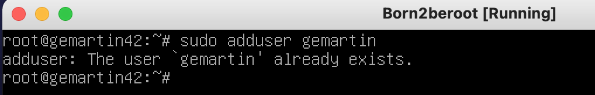

5 ◦ Ahora deberemos crear un nuevo grupo llamado ```user42```. Para crearlo debemos hacer ```sudo addgroup user42```. 


🧠 <b>Que es GID❓</b> Es el identificador de grupo, es una abreviatura de Group 🆔.

🤔 <b> Se ha creado correctamente el grupo? </b> Lo cierto es que si ya que no ha habido ningún mensaje de error, aún así podemos comprobar si se ha creado con el comando ```getent group nombre_grupo``` o también podemos hacer ```cat /etc/group``` y podremos ver todos los grupos y los usuarios que hay dentro de ellos.

6 ◦ Con el comando ```sudo adduser user group``` incluiremos al usuario en el grupo. Debemos incluir al usuario en los grupos ```sudo``` y ```user42```.


7 ◦ Una vez los hayamos introducido para checkear que todo se haya hecho correctamente podemos ejecutar el comando ```getent group nombre_grupo``` o tambien podemos editar el fichero /etc/group ```nano /etc/group``` y en los grupos ```sudo``` y ```login42``` debera aparecer nuestro usuario.


### 4.2 - Instalación y configuración SSH 📶

🧠 <b> Que es SSH❓</b> Es el nombre de un protocolo y del programa que lo implementa cuya principal función es el acceso remoto a un servidor por medio de un canal seguro en el que toda la información está cifrada.

1 ◦ Lo primero que haremos será hacer ```sudo apt update``` para actualizar los repositorios que definimos en el archivo /etc/apt/sources.list


2 ◦ Acto seguido instalaremos la herramienta principal de conectividad para el inicio de sesión remoto con el protocolo SSH, esta herramienta es OpenSSH. Para instalarla debemos introducir el comando ```sudo apt install openssh-server```. En el mensaje de confirmación ponemos ```Y```, acto seguido esperaremos a que termine la instalación.


Para comprobar que se haya instalado correctamente haremos ```sudo service ssh status``` y nos debe aparecer active.


3 ◦ Una vez terminada la instalación se han creado algunos ficheros que debemos configurar. Para ello utilizaremos [Nano](https://es.wikipedia.org/wiki/GNU_Nano) o si tu lo prefieres otro editor de texto. El primer fichero que editaremos será ```/etc/ssh/sshd_config```. Si no estas desde el usuario root no tendrás permisos de escritura, para ello haremos ```su``` y ponemos la contraseña para entrar al usuario root o si no quieres entrar en el usuario root ponemos sudo al principio del comando ```sudo nano /etc/ssh/sshd_config```.


4 ◦ Los ```#``` al comienzo de una línea significan que esta comentada, las líneas que vayamos a modificar deberás quitarle el comentario. Una vez estemos editando el fichero deberemos modificar las siguientes líneas:

➤ #Port 22 -> Port 4242


➤ #PermitRootLogin prohibit-password -> PermitRootLogin no


Una vez hayamos modificado esas líneas debemos guardar los cambios realizados sobre el fichero y dejar de editarlo.

5 ◦ Ahora debemos editar el fichero ```/etc/ssh/ssh_config```.


Editaremos la siguiente línea: 

➤ #Port 22 -> Port 4242


6 ◦ Por último debemos reiniciar el servicio ssh para que así se actualicen las modificaciones que acabamos de realizar. Para ello debemos escribir el comando ```sudo service ssh restart``` y una vez reseteado miraremos el estado actual con ```sudo service ssh status``` y para confirmar que se hayan realizado los cambios en la escucha del servidor debe aparecer el Puerto 4242.


### 4-3 Instalació y configuración de UFW 🔥🧱

🧠 <b>Que es [UFW](https://es.wikipedia.org/wiki/Uncomplicated_Firewall)❓</b> Es un [firewall](https://es.wikipedia.org/wiki/Cortafuegos_(inform%C3%A1tica)) el cual utiliza la línea de comandos para configurar las [iptables](https://es.wikipedia.org/wiki/Iptables) usando un pequeño número de comandos simples.

1 ◦ Lo primero que debemos hacer el instalar UFW, para ello haremos uso del comando ```sudo apt install ufw``` acto seguido escribiremos una ```y``` para confirmar que deseamos instalarlo y esperaremos a que termine.


2 ◦ Una vez instalado debemos habilitarlo , para ello debemos poner el siguiente comando ```sudo ufw enable``` y acto seguido nos debe indicar que el firewall esta activo.


3 ◦ Ahora lo que debemos hacer es que nuestro firewall permita las conexiones que se lleven a cabo mediante el puerto 4242. Lo haremos con el siguiente comando ```sudo ufw allow 4242```.


4 ◦ Por último comprobaremos que esta todo correctamente configurado mirando el estado de nuestro cortafuegos , en donde ya debe aparecer como permitidas las conexiones mediante el puerto 4242. Para ver el estado daremos uso del comando ```sudo ufw status```.


### 4-4 Configurar contraseña fuerte para sudo 🔒

1 ◦ Crearemos un fichero en la ruta /etc/sudoers.d/ a mi fichero yo le he decidido llamar sudo_config ya que en ese fichero se almacenará la configuración de la contraseña. El comando exacto para crear el fichero es ```touch /etc/sudoers.d/sudo_config```.


2 ◦ Debemos crear el directorio sudo en la ruta /var/log porque cada comando que ejecutemos con sudo , tanto el input como el output debe quedar almacenado en ese directorio. Para crearlo utilizaremos el comando ```mkdir /var/log/sudo```.


3 ◦ Debemos editar el fichero creado en el paso 1. Como he comentado anteriormente puedes utilizar el editor que mas te guste , pero yo dare uso de nano. Comando para editar el fichero:  ```nano /etc/sudoers.d/sudo_config```.


4 ◦ Una vez estamos editando el fichero deberemos introducir los siguientes comandos para cumplir todos los requisitos que pide el subject.

```
Defaults  passwd_tries=3
Defaults  badpass_message="Mensaje de error personalizado"
Defaults  logfile="/var/log/sudo/sudo_config"
Defaults  log_input, log_output
Defaults  iolog_dir="/var/log/sudo"
Defaults  requiretty
Defaults  secure_path="/usr/local/sbin:/usr/local/bin:/usr/sbin:/usr/bin:/sbin:/bin:/snap/bin"
```

➤ Como debería verse el fichero.


🤔 <b>Que hace cada comando❓ </b>


### 4-5 Configuración de política de contraseñas fuerte 🔑

1 ◦ El primer paso será editar el fichero login.defs.


2 ◦ Una vez estemos editando el fichero modificaremos los siguientes parametros: 

➤ PASS_MAX_DAYS 99999 -> PASS_MAX_DAYS 30

➤ PASS_MIN_DAYS 0 -> PASS_MIN_DAYS 2


PASS_MAX_DAYS: Es el tiempo de expiración de la contraseña. El numero corresponde a días.

PASS_MIN_DAYS: El número mínimo de días permitido antes de modificar una contraseña.

PASS_WARN_AGE: El usuario recibira un mensaje de aviso indicando que faltan los dias especificados para que expire su contraseña.

3 ◦ Para poder seguir con la configuración debemos instalar los siguientes paquetes con este comando ```sudo apt install libpam-pwquality``` , acto seguido pondremos ```Y``` para confirmar la instalación y esperaremos a que termine. 


4 ◦ Lo siguiente que debemos hacer es volver a editar un fichero y modificar algunas líneas. Haremos ```nano /etc/pam.d/common-password```. 


5 ◦ Despues de retry=3 debemos añadir los siguientes comandos:

```
minlen=10
ucredit=-1
dcredit=-1
lcredit=-1
maxrepeat=3
reject_username
difok=7
enforce_for_root
```
➤ Así debe ser la línea ↙️


➤ Así se debe ver en el fichero ↙️


🤔 <b>Que hace cada comando❓</b>

minlen=10 ➤ La cantidad minima de caracteres que debe contener la contraseña.

ucredit=-1 ➤ Como mínimo debe contener una letra mayúscula. Ponemos el - ya que debe contener como mínimo un caracter, si ponemos + nos referimos a como maximo esos caracteres.

dcredit=-1 ➤ Como mínimo debe contener un digito.

lcredit=-1 ➤ Como mínimo debe contener una letra minúscula.

maxrepeat=3 ➤ No puede tener más de 3 veces seguidas el mismo caracter.

reject_username ➤ No puede contener el nombre del usuario.

difok=7 ➤  Debe tener al menos 7 caracteres que no sean parte de la antigua contraseña. 

enforce_for_root ➤ Implementaremos esta política para el usuario root.

### 4-6 Conectarse via SSH 🗣

1 ◦ Para conectarnos por SSH debemos cerrar la máquina, abrir VirtualBox y darle a configuración.


2 ◦ Una vez en configuración debemos pinchar sobre el apartado de ```Red``` , pincharemos sobre ```Avanzadas``` para que así nos muestre más opciones y le daremos a ```Reenvío de puertos```.


3 ◦ Pincharemos sobre el siguiente emoticono para agregar una regla de reenvío.


4 ◦ Por último agregaremos el puerto ```4242``` al anfitrión y al invitado. Las IP's no son necesarias. Pincharemos sobre el botón de aceptar para que así se apliquen los cambios.


➤ Para poder conectarnos a la máquina virtual desde la real debemos abrir un terminal en la máquina real y escribir ```ssh gemartin@localhost -p 4242``` nos pedirá la clave del usuario y una vez la introduzcamos ya nos saldrá el login en verde y eso significa que estaremos conectados.


## 5- Script 🚨

Esta es una parte muy importante del proyecto. Debes prestar atención en todo, muy importante no copiar y pegar directamente el fichero sin saber que hace cada cosa. En la evaluación debes explicar cada comando si el evaluador lo pide.

🧠 <b>Que es un script❓</b> Es una secuencia de comandos guardada en un fichero que cuando se ejecuta hara la funcion de cada comando.

### 5-1 Architecture 

Para poder ver la arquitectura del SO y su versión de kernel utilizaremos el comando ```uname -a``` ( "-a" == "--all" ) que basicamente printara toda la información excepto si el tipo de procesador es desconocido o la plataforma de hardware. 


### 5-2 Núcleos físicos

Para poder mostrar el numero de nucleos fisicos haremos uso del fichero /proc/cpuinfo el cual  proporciona información acerca del procesador: su tipo, marca, modelo, rendimiento, etc. Usaremos el comando ```grep "physical id" /proc/cpuinfo | wc -l``` con el comando grep buscaremos dentro del fichero "physical id" y con wc -l contaremos las lineas del resultado de grep. Esto lo hacemos ya que la manera de cuantificar los nucleos no es muy común. Si hay un procesador marcará 0 y si tiene más de un procesador, mostrará toda la información del procesador por separado contando los procesadores usando la notación cero. De esta manera simplemente contaremos las lineas que hay ya que es más cómodo cuantificarlo así.


### 5-3 Núcleos virtuales

Para poder mostrar el numero de nucleos virtuales es muy parecido al anterior. Haremos uso de nuevo del fichero /proc/cpuinfo , pero, en este caso utilizaremos el comando ```grep processor /proc/cpuinfo | wc -l```. El uso es practicamente el mismo al anterior solo que en vez de contar las lineas de "physical id" lo haremos de processor. Lo hacemos así por el mismo motivo de antes, la manera de cuantificar marca 0 si hay un procesador.


### 5-4 Memoria RAM

Para mostrar la memoria ram haremos uso del comando ```free``` para así ver al momento información sobre la ram, la parte usada, libre, reservada para otros recursos, etc. Para más info sobre el comando pondremos free --help. Nosotros daremos uso de free --mega ya que en el subject aparece esa unidad de medida (Megabyte). Es importante poner --mega y no -m. Con -m nos referiremos a la unidad de medida Mebibyte y no es la que especifica el subject.


Una vez hemos ejecutado este comando debemos filtrar nuestra busqueda ya que no necesitamos toda la información que nos aporta , lo primero que debemos mostrar es la memoria usada, para ello haremos uso del comando ```awk``` que lo que hace este comando es para procesar datos basados en archivos de texto, es decir, podremos utilizar los datos que nos interesen de X fichero. Por último lo que haremos será comparar si la primera palabra de una fila es igual a "Mem:" printaremos la tercera palabra de esa fila que será la memoria usada. Todo el comando junto seria ```free --mega | awk '$1 == "Mem:" {print $3}'```. En el script el valor de retorno de este comando se lo asignaremos a una variable que concatenaremos con otras variables para que todo quede igual como especifica el subject.


Para obtener la memoria total el comando es practicamente igual al anterior lo único que deberemos cambiar es que en vez de printar la tercera palabra de la fila queremos la segunda ```free --mega | awk '$1 == "Mem:" {print $2}'```.


Por última parte debemos calcular el % de memoria usada. El comando de nuevo es parecido a los anteriores la única modificación que haremos en la parte del printeo. Como la operación para conseguir el tanto porciento no es exacta nos puede dar muchos decimales y en el subject solo aparecen 2 asique nosotros haremos lo mismo, por eso utilizamos ```%.2f``` para que asi solo se muestren 2 decimales. Otra cosa que quizás no sepas es en printf para que se muestre un ```%``` hay que poner ```%%```. Todo el comando ```free --mega | awk '$1 == "Mem:" {printf("(%.2f%%)\n", $3/$2*100)}'```.


### 5-5 Memoria del disco

Para poder ver la memoria del disco ocupada y disponible utilizaremos el comando ```df``` que significa "disk filesystem" , se utiliza para obtener un resumen completo del uso del espacio en disco. Como en el subject indica la memoria utilizada se muestra en MB asi que entonces utilizaremos el flag -m. Acto seguido haremos un grep para que solo nos muestre las lineas que contengan "/dev/" y seguidamente volveremos a hacer otro grep con el flag -v para excluir las lineas que contengan "/boot". Por último utilizaremos el comando awk y sumaremos el valor de la tercera palabra de cada linea para una vez sumadas todas las lineas printar el resultado final de la suma. El comando entero es el siguiente: ```df -m | grep "/dev/" | grep -v "/boot" | awk '{memory_use += $3} END {print memory_use}'```.


Para obtener el espacio total utilizaremos un comando muy parecido. Las unicas diferencias seran que los valores que sumaremos seran los $2 en vez de $3 y la otra diferencia es que en el subject aparece el tamaño total en Gb asique como el resultado de la suma nos da el numero en Mb debemos transformarlo a Gb , para ello debemos dividir el numero entre 1024 y quitar los decimales.


Por último debemos mostrar un porcentaje de la memoria usada. Para ello , de nuevo, utilizaremos un comando muy parecido a los dos anteriores. Lo unico que cambiaremos es que combinaremos los dos comandos anteriores para tener dos variables , una que representa la memoria usada y la otra la total. Hecho esto haremos una operacion para conseguir el tanto por ciento ```use/total*100``` y el resultado de esta operacion lo printaremos como aparece en el subject , entre parentesis y con el simbolo % al final. El comando final es este: ```df -m | grep "/dev/" | grep -v "/boot" | awk '{use += $3} {total += $2} END {printf("(%d%%)\n"), use/total*100}'```.


### 5-6 Porcentaje uso de CPU

Para poder ver el porcentaje de uso de CPU haremos uso del comando ```vmstat``` este muestra estadísticas del sistema, permitiendo obtener un detalle general de los procesos, uso de memoria, actividad de CPU, estado del sistema, etc. Podriamos poner si ninguna opción pero en mi caso pondré un intervalo de segundos de 1 a 4. Tambien daremos uso del comando ```tail -1``` que este lo que nos va a permitir es que solo produzca el output la ultima linea, entonces de las 4 generadas solo se printara la ultima. Por ultimo solo printaremos la palabra 15 que es el uso de memoria disponible. El comando entero es el siguiente: ```vmstat 1 4 | tail -1 | awk '{print %15}'```. El resultado de este comando solo es una parte del resultado final ya que todavia hay que hacer alguna operación en el script para que quede bien. Lo que habria que hacer es a 100 restarle la cantidad que nos ha devuelto nuestro comando, el resultado de esa operación lo printaremos con un decimal y un % al final y ya estaría hecha la operación. 


### 5-7 Último reinicio

Para ver la fecha y hora de nuestro último reinicio haremos uso del comando ```who``` con el flag ```-b``` ya que con ese flag nos mostrará por pantalla el tiempo del último arranque del sistema. Como ya nos ha pasado anteriormente nos muestra más información de la que deseamos asique filtraremos y solo mostraremos lo que nos interesa, para ello haremos uso del comando awk y compararemos si la primera palabra de una linea es "system" se printara por pantalla la tercera palabra de esa linea , un espacio y la cuarta palabra. El comando entero seria el siguiente: ```who -b | awk '$1 == "system" {print $3 " " $4}'```.


### 5-8 Uso LVM

Para checkear si LVM esta activo o no haremos uso del comando lsblk , este nos muestra información de todos los dispositivos de bloque (discos duros, SSD, memorias, etc) entre toda la información que proporciona podemos ver lvm en el tipo de gestor. Para este comando haremos un if ya que o printaremos Yes o No. Basicamente la condicion que buscamos sera contar el numero de lineas en las que aparece "lvm" y si hay mas de 0 printamos Yes, si hay 0 se printara No. Todo el comando seria: ```if [ $(lsblk | grep "lvm" | wc -l) -gt 0 ]; then echo yes; else echo no; fi```.


### 5-9 Conexiones TCP

Para mirar el numero de conexiones TCP establecidas. Utilizaremos el comando ```ss``` sustituyendo al ya obsoleto netstat. Filtraremos con el flag ```-ta``` para que solo se muestren las conexiones TCP. Por último haremos un grep para ver las que estan establecidas ya que tambien hay solo de escucha y cerraremos con wc -l para que cuente el numero de lineas. El comando queda tal que asi: ```ss -ta | grep ESTAB | wc -l```. 


### 5-10 Número de usuarios

Daremos uso del comando ```users``` que nos mostrará el nombre de los usuarios que hay, sabiendo esto, pondremos wc -w para que cuente la cantidad de palabras que hay en la salida del comando. El comando entero queda así ```users | wc -w```.


### 5-11 Dirección IP y MAC

Para obtener la dirección del host haremos uso del comando ```hostname -I``` y para obtener la MAC haremos uso del comando ```ip link``` que se utiliza para mostrar o modificar las interfaces de red. Como aparecen más de una interfaz, IP's etc. Utilizaremos el comando grep para buscar lo que deseamos y asi poder printar por pantalla solo lo que nos piden. Para ello pondremos ```ip link | grep "link/ether" | awk '{print $2}'``` y de esta manera solo printaremos la MAC.


### 5-12 Número de comandos ejecutados con sudo

Para poder obtener el numero de comandos que son ejecutados con sudo haremos uso del comando jornalctl que este es una herramienta que se encarga de recopilar y administrar los registros del sistema. Acto seguido pondremos ```_COMM=sudo``` par así filtrar las entradas especificando su ruta. En nuestro ponemos ```_COMM``` ya que hace referencia a un script ejecutable. Una vez tengamos filtrada la busqueda y solo aparezcan los registros de sudo todavía deberemos filtrar un poco más ya que cuando incias o cierras sesion de root tambien aparece en el registro, entonces para terminar de filtrar pondremos un ```grep COMMAND``` y asi solo apareceran las lineas de comandos. Por ultimo pondremos ```wc -l``` para que asi nos salgan enumeradas las lineas. El comando entero es el siguiente: ```journalctl _COMM=sudo | grep COMMAND | wc -l)```. Para comprobar que funcione correctamente podemos correr el comando en el terminal, poner un comando que incluya sudo y volver a correr el comando y deberá
incrementar el número de ejecucciones de sudo.


### 5-13 Resultado total del script

⚠️ Recuerda no hacer copia y pega si no sabes el funcionamiento de cada comando ⚠️

```
#!/bin/bash

# ARCH
arch=$(uname -a)

# CPU PHYSICAL
cpuf=$(grep "physical id" /proc/cpuinfo | wc -l)

# CPU VIRTUAL
cpuv=$(grep "processor" /proc/cpuinfo | wc -l)

# RAM
ram_total=$(free --mega | awk '$1 == "Mem:" {print $2}')
ram_use=$(free --mega | awk '$1 == "Mem:" {print $3}')
ram_percent=$(free --mega | awk '$1 == "Mem:" {printf("%.2f"), $3/$2*100}')

# DISK
disk_total=$(df -m | grep "/dev/" | grep -v "/boot" | awk '{disk_t += $2} END {printf ("%.1fGb\n"), disk_t/1024}')
disk_use=$(df -m | grep "/dev/" | grep -v "/boot" | awk '{disk_u += $3} END {print disk_u}')
disk_percent=$(df -m | grep "/dev/" | grep -v "/boot" | awk '{disk_u += $3} {disk_t+= $2} END {printf("%d"), disk_u/disk_t*100}')

# CPU LOAD
cpul=$(vmstat 1 2 | tail -1 | awk '{printf $15}')
cpu_op=$(expr 100 - $cpul)
cpu_fin=$(printf "%.1f" $cpu_op)

# LAST BOOT
lb=$(who -b | awk '$1 == "system" {print $3 " " $4}')

# LVM USE
lvmu=$(if [ $(lsblk | grep "lvm" | wc -l) -gt 0 ]; then echo yes; else echo no; fi)

# TCP CONNEXIONS
tcpc=$(ss -ta | grep ESTAB | wc -l)

# USER LOG
ulog=$(users | wc -w)

# NETWORK
ip=$(hostname -I)
mac=$(ip link | grep "link/ether" | awk '{print $2}')

# SUDO
cmnd=$(journalctl _COMM=sudo | grep COMMAND | wc -l)

wall "	Architecture: $arch
	CPU physical: $cpuf
	vCPU: $cpuv
	Memory Usage: $ram_use/${ram_total}MB ($ram_percent%)
	Disk Usage: $disk_use/${disk_total} ($disk_percent%)
	CPU load: $cpu_fin%
	Last boot: $lb
	LVM use: $lvmu
	Connections TCP: $tcpc ESTABLISHED
	User log: $ulog
	Network: IP $ip ($mac)
	Sudo: $cmnd cmd"
```
Script visto desde nano ↙️


Resultado tras la ejecución del script ↙️


## 6- Crontab ⏰

🧠 <b>Que es crontab? </b>Es un administrador de procesos en segundo plano. Los procesos indicados seran ejecutados en el momento que especifiques en el fichero crontab.

Para tener correctamente crontab configurado debemos editar el fichero crontab con el siguiente comando ```sudo crontab -u root -e```. 

En el fichero debemos añadir el siguiente comando para que el script se ejecute cada 10 minutos ```*/10 * * * * sh /ruta del script```. 


Funcionamiento de cada parametro de crontab: 

m ➤ Corresponde al minuto en que se va a ejecutar el script, el valor va de 0 a 59.

h ➤ La hora exacta, se maneja el formato de 24 horas, los valores van de 0 a 23, siendo 0 las 12:00 de la medianoche.
dom ➤ hace referencia al día del mes, por ejemplo se puede especificar 15 si se quiere ejecutar cada dia 15.

dow ➤ Significa el día de la semana, puede ser numérico (0 a 7, donde 0 y 7 son domingo) o las 3 primeras letras del día en inglés: mon, tue, wed, thu, fri, sat, sun.

user ➤ Define el usuario que va a ejecutar el comando, puede ser root, u otro usuario diferente siempre y cuando tenga permisos de ejecución del script.

command ➤ Refiere al comando o a la ruta absoluta del script a ejecutar.

## 7- Signature.txt 📝

Para obtener la firma lo primero que debemos hacer es apagar la máquina virtual ya que una vez la enciendas o modifiques algo la firma cambiará.


El siguiente paso será ubicarnos en la ruta donde tengamos el .vdi de nuestra maquina virtual. 


Por último haremos ```shasum nombremaquina.vdi``` y esto nos dara la firma. El resultado de esta firma es lo que tendremos añadir a nuestro fichero signature.txt para posteriormente subir el fichero al repositorio de la intra. Muy importante no volver a abrir la maquina ya que se modificara la firma. Para las correcciones recuerda clonar la maquina ya que asi podras encenderla sin miedo a que cambie la firma.

🧠 <b> Que es shasum❓</b> Es un comando que permite identificar la integridad de un fichero mediante la suma de comprobación del hash SHA-1 de un archivo.


## 8- Bonus ⭐️

### 8.1- Particionado manual del disco

1 ◦ En el momento de escoger el particionado de disco seleccionaremos manual. De esta manera podremos editar las particiones una a una.


2 ◦ En este apartado nos muestra una descripción general de nuestras particiones y puntos de montaje. Actualmente no tenemos particiones hechas. Para crear una nueva tabla de particiones debemos escoger el dispositivo donde queremos crearlas. En nuestro caso escogeremos el único disponible.


3 ◦ Aceptamos el mensaje de confirmación. Básicamente nos avisa que si ya hay particiones en el dispositivo seran eliminadas y que si estamos seguros de crear una nueva tabla de particiones vacía..


4 ◦ Una vez hemos completado el paso anterior podemos ver como nos aparece nuestra tabla de particiones vacía. Ahora debemos configurarla , para ello debemos seleccionarla.


5 ◦ Crearemos una nueva partición.


Empezaremos creando esta:

<!--

-->


6 ◦ Como bien indica el subject el tamaño de la partición debe ser de 500 megabytes.


7 ◦ Escogemos el tipo de la partición. Escogemos primaria ya que será la partición donde se encontrará instalado el Sistema Operativo.


Descripción breve de todos los tipos de particiones:

◦ <b>Primaria:</b> La única partición en la que puede estar instalada un SO. Solo pueden haber 4 particiones primarias por disco duro o 3 primarias y una extendida.

◦ <b>Secundario/Extendida:</b>  Fue ideada para romper la limitación de 4 particiones primarias en un solo disco físico. Solo puede existir una partición de este tipo por disco, y solo sirve para contener particiones lógicas.

◦ <b>Lógica:</b>  Ocupa una porción de la partición extendida/primaria o la totalidad de la misma, la cual se ha formateado con un tipo específico de sistema de archivos (en nuestro caso usaremos ext4) y se le ha asignado una unidad, así el sistema operativo reconoce las particiones lógicas o su sistema de archivos. Puede haber un máximo de 23 particiones lógicas en una partición extendida , sin embargo linux el SO con el que trabajamos actualmente lo reduce a 15, más que suficientes para realizar este proyecto. 

8 ◦ Seleccionaremos beginning ya que queremos que la nueva partición se cree al principio del espacio disponible.


9 ◦ En la siguiente captura nos muestra los detalles de la partición. Modificaremos el punto de montaje al que escifica el subject.


10 ◦ Escogemos boot como el punto de montaje de nuestra partición.


11 ◦ Terminamos de configurar la partición actual.


12 ◦ Una vez hemos completado el paso anterior ya nos debe aparecer la partición. Ahora debemos crear una partición lógica con todo el espacio disponible del disco, que no tenga punto de montaje y que este encriptada. Para ello seleccionamos el espacio libre donde queremos crearla.


<!-->

-->


13 ◦ Creamos nueva partición.


14 ◦ Seleccionamos el tamaño máximo.


15 ◦ Seleccionamos el tipo de particion, en este caso lógica.


16 ◦ Modificaremos el punto de montaje.


17 ◦ Escogeremos la opción de no montarlo.


18 ◦ Terminamos de configurar la partición actual.


19 ◦ Configuraremos volúmenes encriptados. Para asi poder encriptar nuestra partición.


20 ◦ Aceptamos el mensaje de confirmación.


21 ◦ Creamos los volúmenes encriptados.


22 ◦ Seleccionamos en que partición queremos realizar la encriptación.


23 ◦ Terminamos de configurar la partición actual.


24 ◦ Finalizamos ya que no queremos crear mas volúmenes encriptados.


25 ◦ Aceptamos el mensaje de confirmación. Nos comenta que que se encriptara todo lo que hay dentro de la partición y que no debe tardar mucho en terminar.


26 ◦ Nos da igual si tarda mucho o poco , le damos a cancel ya que no hay nada que encriptar ya que la partición esta vacía.


27 ◦ De nuevo deberemos poner una contraseña, esta vez será la frase de encriptación. Como te he comentado previamente deberás repetir el proceso y la debes anotar ya que será importante en un futuro.


28 ◦ Repetimos la frase de encriptación.


29 ◦ Configuraremos el gestor de volumenes logicos. 


30 ◦ Aceptaremos en mensaje de confirmación ya que estamos de acuerdo con que se guarden los cambion en el disco.


31 ◦ Crearemos un nuevo grupo de volumen. Los grupos de volúmenes agrupan particiones.


32 ◦ Introduciremos el nombre que queremos darle. ```LVMGroup``` tal y como indica el subject.


33 ◦ Seleccionaremos la partición donde queremos cear el grupo. 


34 ◦ Ahora debemos crear todas las particiones lógicas. Al tener que repetir las mismas acciones varias veces hay capturas que no serán documentadas.

<!--

-->


35 ◦ Empezaremos escogiendo el grupo donde queremos que se creen. Seleccionamos el único disponible (el que acabamos de crear). 


36 ◦ El orden de la creación de las unidades lógicas será el mismo que indica el subject asique empezaremos por root y acabaremos por var-log. Entonces seleccionaremos el nombre del volumen lógico.


37 ◦ Tamaño como bien indica el subject será de 10g.


38 ◦ Repetimos el proceso para ```swap```. Solo cambiaremos el nombre y el tamaño.


39 ◦ Repetimos el proceso para ```home```. Solo cambiaremos el nombre y el tamaño.


40 ◦ Repetimos el proceso para ```var```. Solo cambiaremos el nombre y el tamaño.


41 ◦ Repetimos el proceso para ```srv```. Solo cambiaremos el nombre.


42 ◦ Repetimos el proceso para ```tmp```. Solo cambiaremos el nombre.


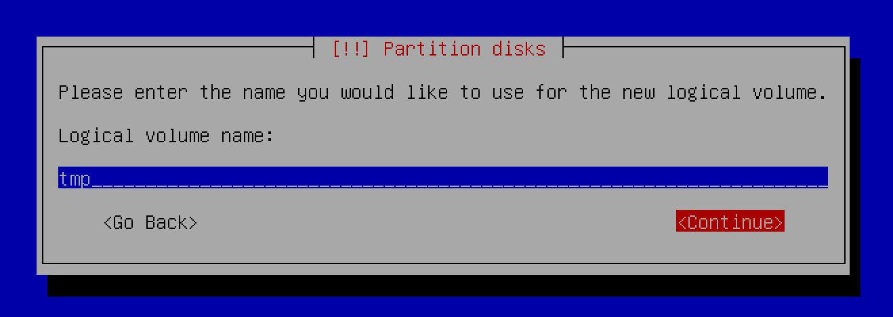


43 ◦ Por último repetimos el proceso para ```var-log```. Solo cambiaremos el nombre y el tamaño.


44 ◦ Una vez hayamos completado todos los pasos anteriores finalizaremos la configuración del gestor de volúmenes lógicos.

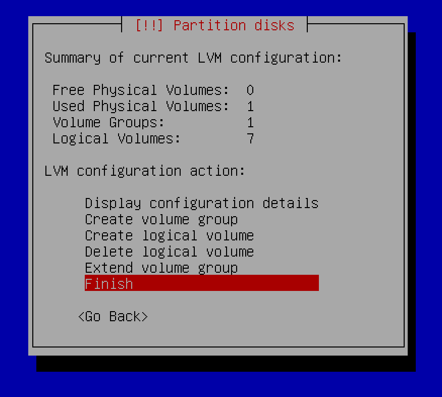

45 ◦ Ahora podemos observar como en el apartado donde nos muestran todas nuestras particiones y espacio libre ya aparecen todas las particiones lógicas que acabamos de crear. Bien , debemos configurar todas para seleccionar el sistema de archivos que queremos y el punto de montaje que indica el subject. De nuevo iremos por orden y seleccionaremos la primera que nos aparece que es ```home```.


46 ◦ Nos muestra la configuración de la partición. Debemos escoger un sistema de ficheros ya que actualmente no tiene.


47 ◦ Escogemos el sistema de archivos Ext4, es el sistema de archivos más utilizado en distribuciones Linux.  


48 ◦ Ahora debemos seleccionar el punto de montaje. 


49 ◦ Seleccionamos ```home``` como bien indica el subject.


50 ◦ Una vez ya lo hemos seleccionado terminaremos la configuración de la partición.


51 ◦ De nuevo estos pasos se pueden volver muy repetitivos asique no comentare mucho. Repetimos todo igual (excepto el punto de montaje) para ```root```.


52 ◦ Repetimos el proceso para ```srv``` y cambiaremos el punto de montaje.


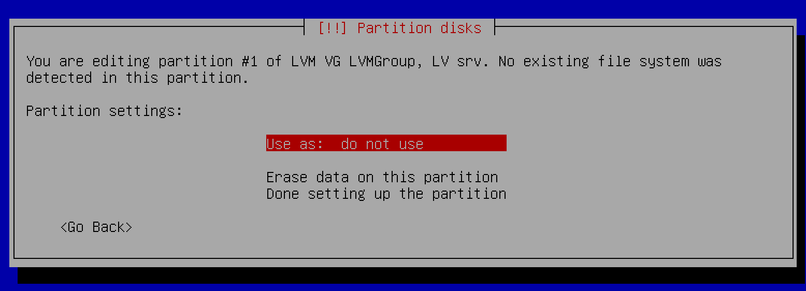


53 ◦ Para ```swap``` haremos una excepción ya el sistema de archivos será diferente. Seleccionamos ```swap```.


54 ◦ En el momento de seleccionar el sistema de archivos lo dejamos en ```swap area```.


55 ◦ Una vez realizado el paso anterior terminaremos la configuración de la partición.


56 ◦ Ahora si volveremos a hacer lo mismo que antes pero ahora lo haremos con ```tmp``` y cambiando el punto de montaje.


57 ◦ Repetimos de nuevo el proceso para ```var``` cambiando el punto de montaje.


58 ◦ Por último repetimos de nuevo el proceso para ```var-log``` en este deberemos introducir manualmente el punto de montaje.


<!-->


-->


59 ◦ Una vez hemos completado todos los pasos anteriores ya casi hemos acabado, debemos darle a finalizar el particionado y asi se guarden todos los cambios en el disco.

<!--

-->


60 ◦ Aceptamos el mensaje y asi se guardaran los cambios. Asegurate que todas las particiones quedan igual que en la captura.

<!--

-->


61 ◦ Seleccionamos la opción ```No``` ya que no necesitamos paquetes adicionales. 


62 ◦ Escogemos nuestro País.


63 ◦ Escogemos ```deb.debian.org``` ya que tenindo en cuenta nuestra region es donde tendremos una mejor conexión.


64 ◦ Esta opción la dejaremos vacía le daremos directamente a ```Continue```.


65 ◦ Seleccionamos la opcion ```No``` ya que no queremos que los developers vean nuestras estadísticas aunque sean anónimas.


66 ◦ Quitaremos todas las opciones de software (con la barra espaciadora) y le daremos a ```Continue```.


67 ◦ Seleccionaremos ```Yes``` para instalar [GRUB boot](https://es.wikipedia.org/wiki/GNU_GRUB) en el disco duro.


68 ◦ Escogeremos el dispositivo para la instalación del cargador de arranque ```/dev/sda (ata_VBOX_HARDDISK)```.


69 ◦ Le daremos a ```Continue``` para finalizar la instalación. 


70 ◦ Una vez hemos terminado con la instalación de debian debemos configurar nuestra máquina virtual.

[Click aqui para dirigirte a la configuración de la máquina virtual ⚙️](#4-configuración-de-la-máquina-virtual-%EF%B8%8F)

### 8.2 - Wordpress y configuración de servicios 🌐

### Lighttpd 

🧠 <b> Que es Lighttpd❓</b> Es un servidor web diseñado para ser rápido, seguro, flexible, y fiel a los estándares. Está optimizado para entornos donde la velocidad es muy importante. Esto se debe a que consume menos CPU y memoria RAM que otros servidores.

1 ◦ Instalación de paquetes de lighttpd.


2 ◦ Permitimos las conexiones mediante el puerto 80 con el comando ```sudo ufw allow 80```.


3 ◦ Checkeamos que realmente hayamos permitido. Debe aparecer el puerto 80 y allow.


4 ◦ Añadimos la regla que incluya el puerto 80. Si no recuerdas como se añadian reglas en el reenvío de puertos. Configuración de la máquina → Red → Reenvío de puertos → Replicar la captura.


### WordPress 

🧠 <b> Que es Wordpress❓</b> Es un sistema de gestión de contenidos enfocado a la creación de cualquier tipo de página web.

1 ◦ Para instalar la última versión de WordPress primero debemos instalar wget y zip. Para ello haremos uso del siguiente comando ```sudo apt install wget zip```.

🧠 <b> Que es wget❓</b> Es una herramienta de línea de comandos que se utiliza para descargar archivos de la web.

🧠 <b> Que es zip❓</b> Es una utilidad de línea de comandos para comprimir y descomprimir archivos en formato ZIP.


2 ◦ Una vez hayamos instalado los paquetes nos debemos ubicar en la carpeta /var/www/ con el comando cd accederemos a ella ```cd /var/wwww```.


3 ◦ Una vez estemos en la ruta /var/www/ deberemos descargar la última versión de WordPress. Como mi idioma nativo es el español yo seleccionaré la última versión en español. Utilizaremos el siguiente comando: ```sudo wget https://es.wordpress.org/latest-es_ES.zip```.


4 ◦ Descomprimimos el archivo que acabamos de descargar con el comando ```sudo unzip latest-es_ES.zip```.


5 ◦ Renombraremos la carpeta html y la llamaremos html_old. ```sudo mv html/ html_old/```.


6 ◦ Ahora renombraremos la carpeta wordpress y la llamaremos html. ```sudo mv wordpress/ html```.


7 ◦ Por último estableceremos estos permisos en la carpeta html. Daremos uso del comando ```sudo chmod -R 755 html```. El número 7 indica que el propietario tiene permisos de lectura, escritura y ejecución. El número 5 indica que el grupo y otros solo tienen permisos de lectura y ejecución.


### Mariadb

🧠 <b> Que es MariaDB❓</b> Es una base de datos. Se utiliza para diversos fines, como el almacenamiento de datos, el comercio electrónico, funciones a nivel empresarial y las aplicaciones de registro. 

1 ◦ Instalaremos los paquetes con el comando ```sudo apt install mariadb-server```


2 ◦ Debido a que la configuración predeterminada deja su instalación de MariaDB poco segura, utilizaremos un script que proporciona el paquete mariadb-server para restringir el acceso al servidor y eliminar las cuentas no utilizadas. Ejecutaremos el script con el siguiente comando ```sudo mysql_secure_installation```. Una vez ejecutemos el script nos hara una serie de preguntas.Preguntará si deseamos cambiar a la autenticación de socket de Unix. Como ya tenemos una cuenta root protegida escribiremos ```N```.

```
Switch to unix_socket autentication? → N
Change the root password? → N
Remove anonymous users? → Y
Disallow root login remotely? → Y
Remove test database and acces to it? → Y
Reaload privilege tables now? → Y
```


Switch to unix_socket autentication? Escogemos ```N``` porque no deseamos que cambie a la auntenticación de socket de Unix ya tenemos una cuenta root protegida.

Change the root password? Escogemos ```N```. No deseamos cambiar la contraseña del usuario root. Por defecto no tenemos contraseña pero en mariadb realmente no es root ya que debemos darle permisos de administrador.

Remove anonymous users? Escogemos ```Y```. Por defecto cuando instalas mariadb tiene un usuario anonimo, lo que permite que cualquier persona inicie sesión en mariadb sin tener que crear una cuenta de usuario propia. Esto esta diseñado para realizar pruebas y que la instalación sea más fluida. Cuando dejemos el entorno de desarrollo y queramos pasar a un entorno de producción debemos eliminar los usuarios anonimos. 

Disallow root login remotely? Escogemos ```Y```. Al deshabilitar el inicio de sesion en root de forma remota evitaremos que alguien pueda adivinar la contraseña root. Solo podremos conectarnos al root desde localhost.

Remove test database and acces to it? Escogemos ```Y```. De esta manera se eliminará la base de datos de prueba y cualquier usuario que tenga acceso a ella.

Reaload privilege tables now? Escogemos ```Y```. Asi se recargarán las tablas de permisos de MySQL para que los cambios en la configuración de seguridad entren en vigor de inmediato.

1 ◦ Una vez hayamos terminado con la instalación de mariadb debemos crear la base de datos y el usuario para el WordPress. Lo primero debemos acceder a mariadb.


2 ◦ Creamos una base de datos para el WordPress. En mi caso le voy a llamar wp_database. Todo esto lo hare con el comando ```CREATE DATABASE wp_database;```.


3 ◦ Para asegurarnos que se ha creado la base de datos para el WordPress podemos ver todas las bases existentes con el comando ```SHOW DATABASES;```.

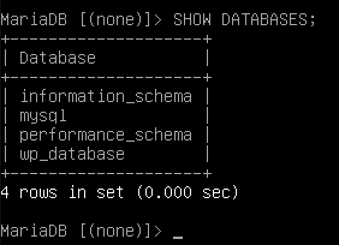

4 ◦ Acto seguido debemos crearemos un usuario dentro de la base de datos. Utilizaremos el comando ```CREATE USER 'gemartin'@'localhost' IDENTIFIED BY '12345';```.


5 ◦ Vinculamos el nuevo usuario a nuestra base de datos de manera que le otorguemos los permisos necesario para poder trabajar. Daremos uso del comando ```GRANT ALL PRIVILEGES ON wp_database.* TO 'gemartin'@'localhost';```.


6 ◦ Actualizamos los permisos para que los cambios tengan efecto con el comando ```FLUSH PRIVILEGES;```.


7 ◦ Una vez hemos completado el paso anterior ya podemos salir de mariadb.


### PHP

🧠 <b> Que es PHP❓</b> Es un lenguaje de programación. Se utiliza principalmente para desarrollar aplicaciones web dinámicas y sitios web interactivos. PHP se ejecuta en el lado del servidor.

1 ◦ Instalamos los paquetes necesarios para poder ejecutar aplicaciones web escritas en lenguaje PHP y que necesiten conectarse a una base de datos MySQL. Ejecutaremos el siguiente comando ```sudo apt install php-cgi php-mysql```.


### Configuración WordPress

1 ◦ Accedemos al directorio /var/www/html con el comando: ```cd /var/www/html```


2 ◦ Copiamos el fichero wp-config-sample.php y lo renombraremos wp-config.php


3 ◦ Una vez lo hayamos renombrado editaremos el fichero wp-config.php ```nano wp-config.php``` y modificaremos los siguientes valores.


Hay que remplazarlos por los valores que hemos puesto anteriormente cuando creábamos la base de datos y el usuario para que WordPress pueda conectar y hacer uso de ella.


4 ◦ Habilitamos el módulo fastcgi-php en Lighttpd para mejorar el rendimiento y la velocidad de las aplicaciones web en el servidor. ```sudo lighty-enable-mod fastcgi```

<!--

-->


5 ◦ Habilitamos el módulo fastcgi-php en Lighttpd para mejorar el rendimiento y la velocidad de las aplicaciones web basadas en PHP en el servidor. ```sudo lighty-enable-mod fastcgi-php```

<!--

-->


6 ◦ Actualizamos y aplicamos los cambios en la configuración con el comando ```sudo service lighttpd force-reload```.

<!--

-->


7 ◦ Una vez ya hemos completado los pasos anteriores podemos volver a dirigirnos a nuestro navegador y escribiremos ```localhost```. Nos deberá salir lo siguiente:


8 ◦ Debemos rellenar todos los campos. En mi caso he puesto lo siguiente:


9 ◦ Una vez hayamos rellenado todos los campos debemos darle a ```Instalar WordPress``` y ya habremos terminado la instalación. Nos saldrá la siguiente pestaña. Ahora WordPress puede crear las tablas y volcar todos los datos que necesita para funcionar en la base de datos que le hemos asignado.


10 ◦ Si accedemos de nuevo a nuestro localhost desde el navegador ya podemos ver nuestra página funcional.


11 ◦ Si queremos acceder al panel de administrador para hacer cambios en nuestra página deberemos poner en el navegador ```localhost/wp-admin``` y iniciaremos sesión con nuestra cuenta.


12 ◦ Una vez accedamos ya podemos modificar lo que queramos a gusto propio. Personalizar la página es algo opcional, como no está especificado en el subject en esta guia no se tratará nada al respecto. 


### 8.3 - Servicio adicional ➕

### LiteSpeed ⚡️

🧠 <b> Que es LiteSpeed❓</b> Es un software de servidor web patentado. Es el cuarto servidor web más popular, y se estima que lo utiliza el 10% de los sitios web.

1 ◦ Antes de instalar cualquier software, es importante asegurarse de que el sistema esté actualizado.

```sudo apt update```


```sudo apt upgrade```

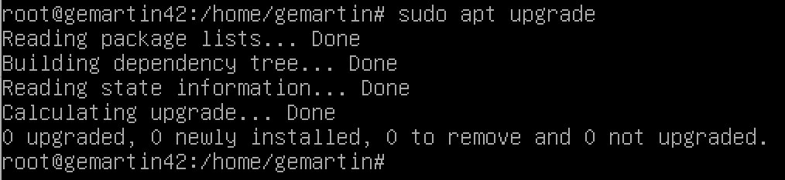

2 ◦ De forma predeterminada, OpenLiteSpeed está disponible en el repositorio base de Debian 11. Entonces, debes ejecutar el siguiente comando para agregar el repositorio OpenLiteSpeed a su sistema Debian:

```wget -O - http://rpms.litespeedtech.com/debian/enable_lst_debian_repo.sh | sudo bash```

Como el comando es largo me he conectado via ssh.


3 ◦ De nuevo, actualizamos los paquetes y instalaremos OpenLiteSpeed.

```sudo apt update```


```sudo apt install openlitespeed```


4 ◦ La contraseña predeterminada para OpenLiteSpeed es 123456. Cambiaremos la contraseña a algo más seguro con el siguiente comando.

```sudo /usr/local/lsws/admin/misc/admpass.sh```


5 ◦ Configuramos el firewall para permitir las conexiones mediante los puertos 8088 y 7080. Acto seguido agregaremos las reglas en el reenvio de puertos.

```sudo ufw allow 8088/tcp```


```sudo ufw allow 7080/tcp```


```sudo ufw reload```


Reglas en el reenvio de puertos.


6 ◦ Una vez completado el paso anterior ya podemos conectarnos. Pondremos en el buscador de nuestro navegador ```localhost:7080``` proporcionamos nuestras credenciales de inicio de sesión y ya tendremos acceso a todo.

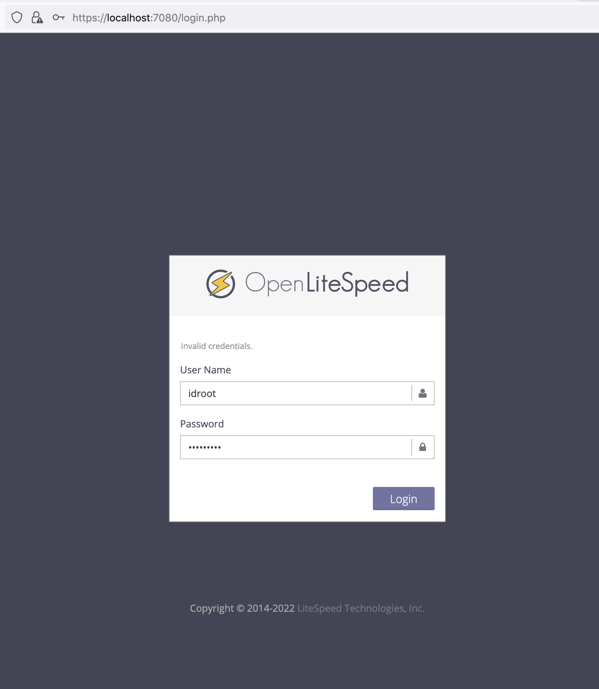


<br>
<br>
<br>

#
# Este tutorial ha llevado mucho trabajo, si crees que te ha sido útil agradeceria mucho starred 🌟 para que así se comparta y pueda ayudar a más estudiantes 👨🏻‍🎓❤️
<br>
<br>
<br>


## 9- Hoja de corrección ✅


## 9-1 Respuestas de la evaluación 💯

### ▪️ Que es una maquina virtual❓

Es un software que simula un sistema de computación y puede ejecutar programas como si fuese una computadora real. Permite crear múltiples entornos simulados o recursos dedicados desde un solo sistema de hardware físico. 

### ▪️ Porque has escogido Debian❓

Esto es algo personal para cada uno, mi opinion: El propio subject explica que es mas sencillo hacerlo en Debian y si buscas documentacion/tutoriales hay muchos y todos se han hecho en debian.

### ▪️ Diferencias basicas entre Rocky y Debian

<!-->

-->


### ▪️ Cual es el proposito de las maquinas virtuales❓

Su objetivo es el de proporcionar un entorno de ejecución independiente de la plataforma de hardware y del sistema operativo, que oculte los detalles de la plataforma subyacente y permita que un programa se ejecute siempre de la misma forma sobre cualquier plataforma.

### ▪️ Diferencias entre apt y aptitude ↙️

Aptitude es una version mejorada de apt. APT es un administrador de paquetes de nivel inferior y aptitude es un administrador de paquetes de alto nivel. Otra gran diferencia es la funcionalidad que ofrecen ambas herramientas. Aptitude ofrece una mejor funcionalidad en comparación con apt-get. Ambos son capaces de de proporcionar los medios necesarios para realizar la gestión de paquetes. Sin embargo, si se busca un enfoque con mas caracteristicas, debería ser, Aptitude. 

### ▪️ Que es APPArmor❓

Es un módulo de seguridad del kernel Linux que permite al administrador del sistema restringir las capacidades de un programa.

### ▪️ Que es LVM❓

Es un gestor de volúmenes lógicos. Proporciona un método para asignar espacio en dispositivos de almacenamiento masivo, que es más flexible que los esquemas de particionado convencionales para almacenar volúmenes.

## 9-2 Comandos de la evaluación ⌨️

1 ◦ Comprobar que no haya ninguna interfaz grafica en uso.

Utilizaremos el comando ```ls /usr/bin/*session``` y nos debe aparecer el mismo resultado que en la captura. Si aparece algo diferente se esta utilizando una interfaz grafica.


2 ◦ Comprobar que el servicio UFW esta en uso.

```sudo ufw status```


```sudo service ufw status```


3 ◦ Comprobar que el servicio SSH esta en uso.

```sudo service ssh status```


4 ◦ Comprobar que utilizas el sistema operativo Debian o Centos.

```uname -v``` o ```uname --kernel-version```

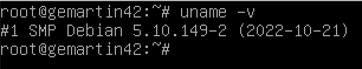

5 ◦ Comprobar que tu usuario este dentro de los grupos "sudo" y "user42".

```getent group sudo```

```getent group user42```


6 ◦ Crear un nuevo usuario y mostrar que sigue la politica de contraseñas que hemos creado.

```sudo adduser name_user``` y introducimos una contraseña que siga la politica.


7 ◦ Creamos un nuevo grupo llamado "evaluating". 

```sudo addgroup evaluating```


8 ◦ Añadimos el nuevo usuario al nuevo grupo.

```sudo adduser name_user evaluating```


Para comprobar que se haya introducido correctamente.


9 ◦ Comprobar que el hostname de la maquina es correcto login42.


10 ◦ Modificar hostname para remplazar tu login por el del evaluador. En este caso lo reemplazare por student42.

```sudo nano /etc/hostname``` y remplazamos nuestro login por el nuevo.


```sudo nano /etc/hosts``` y remplazamos nuestro login por el nuevo.


Reiniciamos la maquina.


Una vez nos hemos logueado de nuevo podemos ver como el hostname se ha cambiado correctamente.


11 ◦ Comprobar que todas las particiones son como indica el subject.

```lsblk```


12 ◦ Comprobar que sudo esta instalado.

```which sudo```


Utilizar which realmente no es una buena practica ya que no todos los paquetes se encuentran en las rutas donde which busca, aun asi para la evaluacion es mejor ya que es un comando sencillo y facil de aprender. Para un mejor uso haremos uso del siguiente comando:

```dpkg -s sudo```


13 ◦ Introducimos el nuevo usuario dentro del grupo sudo.

```sudo adduser name_user sudo```


Comprobamos que esta dentro del grupo.

 

14 ◦ Muestra la aplicación de las reglas impuestas para sudo por el subject.

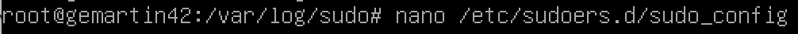


15 ◦ Muestra que la ruta /var/log/sudo/ existe y contiene almenos un fichero, en este se debería ver un historial de los comandos utilizados con sudo.


Ejecuta un comando con sudo y comprueba que se actualiza el fichero.


16 ◦ Comprueba que el programa UFW esta instalado en la maquina virtual y comprueba que funciona correctamente.

```dpkg -s ufw```


```sudo service ufw status```


17 ◦ Lista las reglas activas en UFW si no esta hecha la parte bonus solo debe aparecer la regla para el puerto 4242.

```sudo ufw status numbered```


18 ◦ Crea una nueva regla para el puerto 8080. Comprueba que se ha añadido a las reglas activas y acto seguido puedes borrarla.

```sudo ufw allow 8080``` para crearla


```sudo ufw status numbered```


Para borrar la regla debemos utilizar el comando ```sudo ufw delete num_rule```


Comprobamos que se ha eliminado y vemos el numero de la siguiente regla que hay que borrar.


Borramos de nuevo la regla.


Comprobamos que solo nos quedan las reglas requeridas en el subject.


19 ◦ Comprueba que el servicio ssh esta instalado en la maquina virtual, que funciona correctamente y que solo funciona por el puerto 4242.

```which ssh```


```sudo service ssh status```


20 ◦ Usa ssh para iniciar sesión con el usuario recién creado. Asegurate de que no puede usar ssh con el usuario root.

Intentamos conectarnos por ssh con el usuario root pero no tenemos permisos.


Nos conectamos por ssh con el nuevo usuario con el comando ```ssh newuser@localhost -p 4242```


21 ◦ Modifica el tiempo de ejecución del script de 10 minutos a 1.

Ejecutamos el siguiente comando para asi modificar el fichero crontab ```sudo crontab -u root -e```


Modificamos el primer paramentro , en vez de 10 lo cambiamos a 1.


22 ◦ Finalmente haz que el script deje de ejecutarse cuando el servidor se haya iniciado, pero sin modificar el script.

```sudo /etc/init.d/cron stop```


Si queremos que vuelva a ejecutarse:

```sudo /etc/init.d/cron start```


## 10- Tester 🆗

Comprueba que no te hayas dejado nada! Tester propio para checkear que la instalación y configuración se ha realizado exitosamente.

[AQUÍ](https://github.com/gemartin99/Born2beroot-Tester)


- Roberto del Olmo Lima
- [](https://github.com/legrol)
 &nbsp;&nbsp;&nbsp;&nbsp;&nbsp;&nbsp;&nbsp;&nbsp;[](https://www.linkedin.com/in/roberto-del-olmo-731746245)
